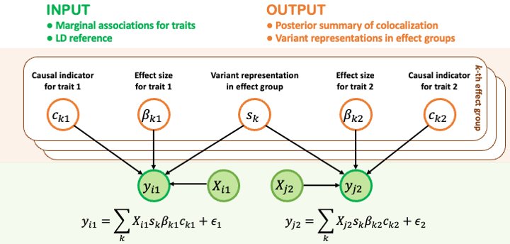

# SharePro for colocalization analysis

SharePro is a command line tool for efficient and accurate colocalization. For analysis conducted in the [SharePro for colocalization analysis paper](https://doi.org/10.1101/2023.07.24.550431), please refer to [SharePro_coloc_analysis](https://github.com/zhwm/sharepro_coloc_analysis).

## Overview 

Colocalization analysis is a commonly used statistical procedure for assessing whether two or more traits share the same genetic signals identified in genome-wide association studies (GWAS). It is important for understanding the interplay between heritable traits.
SharePro takes marginal associations from GWAS summary statistics and linkage disequilibrium (LD) information as inputs, and infers posterior probability of colocalization. Unlike existing methods, SharePro takes an effect group-level approach to integrate LD modelling and colocalization assessment to account for multiple causal variants in colocalization analysis.

<p align="center">
  
  <br>
  <em>Figure 1: SharePro overview.</em>
</p>

## Installation

SharePro was developed under Python 3.9.7 but should be compatible with other versions of Python 3. The following Python modules are required:

* [numpy](http://www.numpy.org/)
* [scipy](http://www.scipy.org/)
* [pandas](https://pandas.pydata.org/getpandas.html)

To install SharePro for colocalization analysis:

```
git clone https://github.com/zhwm/SharePro_coloc.git
cd SharePro_coloc
pip install -r requirements.txt 
``` 

To test the installation and display basic usages:
```
python src/SharePro/sharepro_coloc.py -h
```

## Input files

Example input files are included in the [dat](dat/) directory. 

1. The **GWAS files** contain four mandatory columns: SNP/BETA/SE/N. Here are examples for [BMD](dat/BMD_bse.txt) GWAS and [RSPO3](dat/RSPO3_bse.txt) pQTL zscore files.

2. The **LD file** contains Pearson correlation between variants. **Please make sure the REF/ALT alleles used in calculating LD are the same as the GWAS study!!** An example can be found at [dat/RSPO3.ld](dat/RSPO3.ld).

## Usage examples

We use the colocalization analysis of a RSPO3 cis-pQTL and eBMD GWAS as an example. The [dat/](dat/) folder contains all files required for this example.
If you want to learn more about this locus, please refer to the [analysis repo](https://github.com/zhwm/SharePro_coloc_analysis/tree/main/dat).

We use `--z` and `--ld` to indicate the path to the matched GWAS summary statistic files and the ld file, respectively. Additionally, we can specify path to save results with `--save`. The max number of causal signals can be set to 10 using `--K`.

```
python src/SharePro/sharepro_coloc.py \
--z dat/BMD_bse.txt dat/RSPO3_bse.txt \
--ld dat/RSPO3.ld \
--save doc/res \
--K 10
```

## Output files

The results have been saved into the [**colocalization summary** file](doc/res.sharepro.txt) with columns:
`cs` for variant representations in effect groups; 
`share` for colocalization probabilities;
`variantProb` for variant representation weights in effect groups;

The [log file](doc/res.sharepro.log) contains the expected output of the algorithm, including parameters and the ELBO in each iteration.

## Versions
* Version 1.0.0 (2023/01/25) Initial release
* Version 2.0.0 (2023/08/25) Added K=1 in case of LD mismatch
* Version 3.0.0 (2024/02/21) Added scripts to run SharePro in one locus with GWAS (BETA/SE/N) and ld files
* Version 4.0.0 (2024/04/08) Refactored code

## Citations

If you find SharePro for colocalization analysis useful, please cite:

[Wenmin Zhang, Tianyuan Lu, Robert Sladek, Yue Li, Hamed Najafabadi, Josée Dupuis. SharePro: an accurate and efficient genetic colocalization method accounting for multiple causal signals.](https://doi.org/10.1101/2023.07.24.550431)